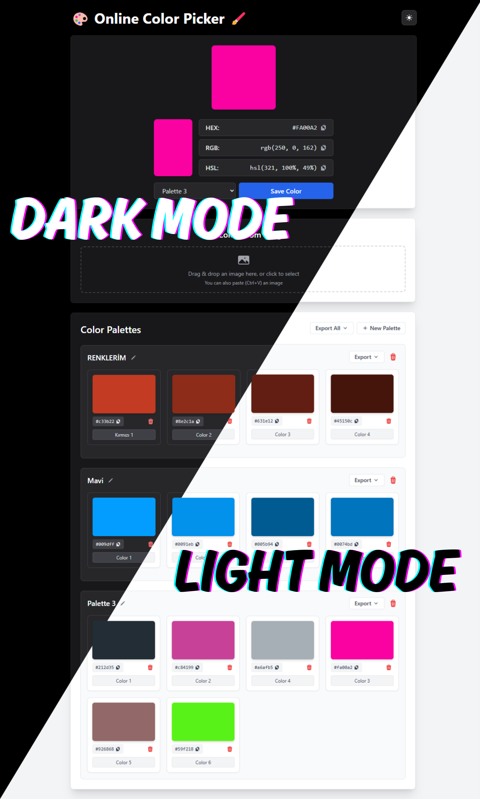
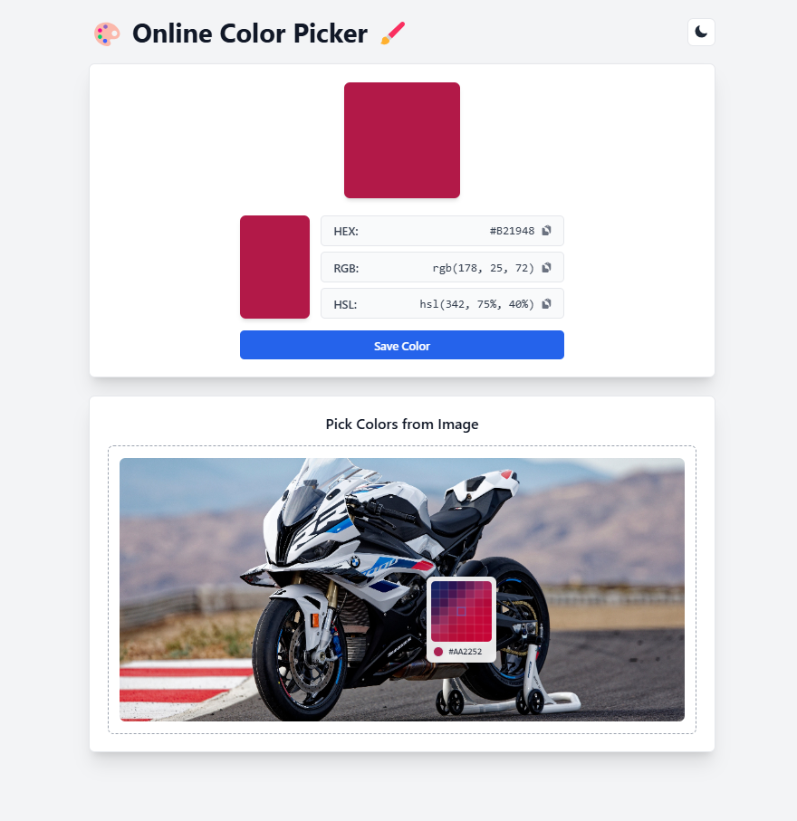
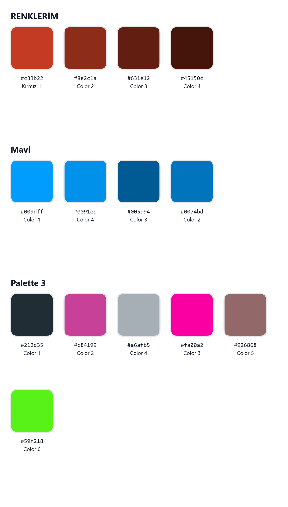

# Online Renk Paleti 🎨

Modern ve kullanıcı dostu bir renk seçici ve palet yönetim aracı.

## Özellikler
- 🎨 Gelişmiş renk seçici
- 📊 HEX, RGB ve HSL renk formatları
- 💾 Renk paleti oluşturma ve yönetme
- 🖼️ Görsellerden renk seçme
- 📱 Mobil uyumlu tasarım
- 🌓 Koyu/Açık tema desteği
- 🔄 Sürükle-bırak renk düzenleme
- 💻 Çoklu dışa aktarma formatları (JSON, CSS, SCSS, TXT, PNG)

## Kullanılan Teknolojiler
- React
- TypeScript
- Tailwind CSS
- Vite
- React DnD (Sürükle-Bırak)
  
## Proje Görselleri

### Ana Sayfa

### Renk Seçici

### Dışa Aktarma

